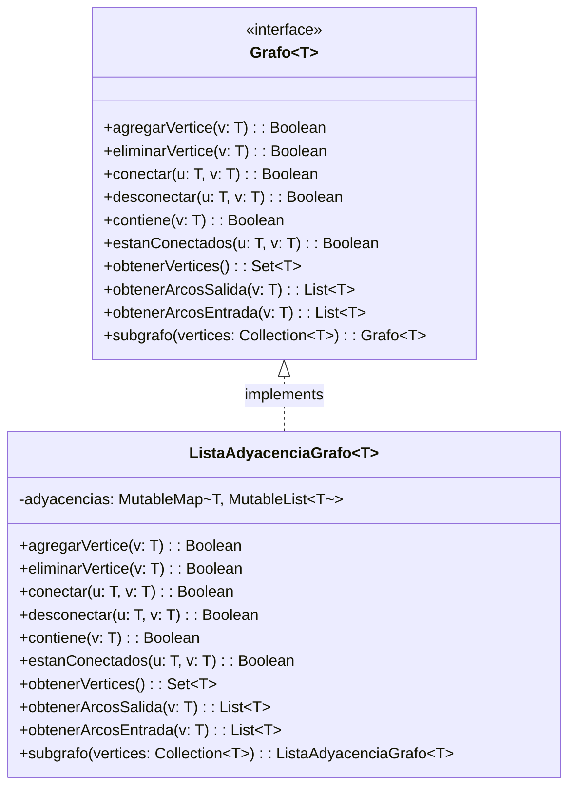

<div align="center">

# 🕸️ Generic Graph Data Structure (Adjacency Lists)

**Robust, type-safe generic directed and undirected graph engine in Kotlin with asymptotic complexity guarantees.**

Developed for **CI-2693: Algorithms and Data Structures III** at [Universidad Simón Bolívar (USB)](https://www.usb.ve/).

[](https://kotlinlang.org/)
[](https://openjdk.org/)
[](#complejidad-computacional-big-o)
[](#autores)

</div>

---

## 📌 Overview

This repository implements a production-grade, generic graph data structure (`ListaAdyacenciaGrafo<T> : Grafo<T>`) using **Adjacency Lists** backed by Kotlin's hash maps and linked structures. The design prioritizes type safety, memory efficiency, and optimal asymptotic time bounds for vertex/edge manipulation, neighborhood traversal, and induced subgraph generation.

---

## 🏛️ Architecture & Interface Contract



---

## ⚡ Asymptotic Computational Complexity (Big O)

Let:
- $V$: Number of vertices in the graph.
- $E$: Number of edges in the graph.
- $D_{out}$: Out-degree of vertex $u$ (number of successors).
- $D_{in}$: In-degree of vertex $v$ (number of predecessors).

| Operation | Complexity | Description & Rationale |
| :--- | :---: | :--- |
| `agregarVertice(v)` | $\mathcal{O}(1)$ | Amortized constant insertion into internal `HashMap`. |
| `contiene(v)` | $\mathcal{O}(1)$ | Key lookup in constant average time. |
| `conectar(u, v)` | $\mathcal{O}(D_{out})$ | Checks adjacency list of $u$ to prevent multi-edges before appending. |
| `desconectar(u, v)` | $\mathcal{O}(D_{out})$ | Linear scan over successors list to remove target edge. |
| `estanConectados(u, v)` | $\mathcal{O}(D_{out})$ | Linear scan across successors of $u$. |
| `obtenerArcosSalida(v)` | $\mathcal{O}(1)$ | Direct reference retrieval to the adjacency list of successors. |
| `obtenerArcosEntrada(v)` | $\mathcal{O}(V + E)$ | Requires filtering predecessors across all incident vertex edge sets. |
| `eliminarVertice(v)` | $\mathcal{O}(V + E)$ | Removes vertex in $\mathcal{O}(1)$ and purges all incoming edges in $\mathcal{O}(V + E)$. |
| `subgrafo(V')` | $\mathcal{O}(V' + E')$ | Computes the induced subgraph for subset $V' \subseteq V$. |

---

## 🛠️ Compilation & Execution

### Prerequisites
- Java JDK 11 or higher.
- Kotlin Compiler (`kotlinc`).

### Building from CLI
```bash
# Clone the repository
git clone https://github.com/soyvistorrr/proyecto1-algos.git
cd proyecto1-algos

# Compile all Kotlin sources into executable JAR
kotlinc *.kt -include-runtime -d ProyectoGrafo.jar

# Run the program
java -jar ProyectoGrafo.jar
```

### Usage Example
```kotlin
fun main() {
    val grafo = ListaAdyacenciaGrafo<Int>()
    
    // Add vertices
    grafo.agregarVertice(1)
    grafo.agregarVertice(2)
    grafo.agregarVertice(3)

    // Connect directed edges: 1 -> 2, 2 -> 3, 1 -> 3
    grafo.conectar(1, 2)
    grafo.conectar(2, 3)
    grafo.conectar(1, 3)

    println("Vertices: ${grafo.obtenerVertices()}")
    println("Arcos de salida de 1: ${grafo.obtenerArcosSalida(1)}")
    
    // Extract induced subgraph for vertices {1, 2}
    val sub = grafo.subgrafo(listOf(1, 2))
    println("Subgrafo inducido: $sub")
}
```

---

## 👥 Authors
- **Victor Hernández** ([@soyvistorrr](https://github.com/soyvistorrr))
- **Daniela Gragirena** ([@DanielaGragirena](https://github.com/DanielaGragirena))

Universidad Simón Bolívar, Caracas, Venezuela.